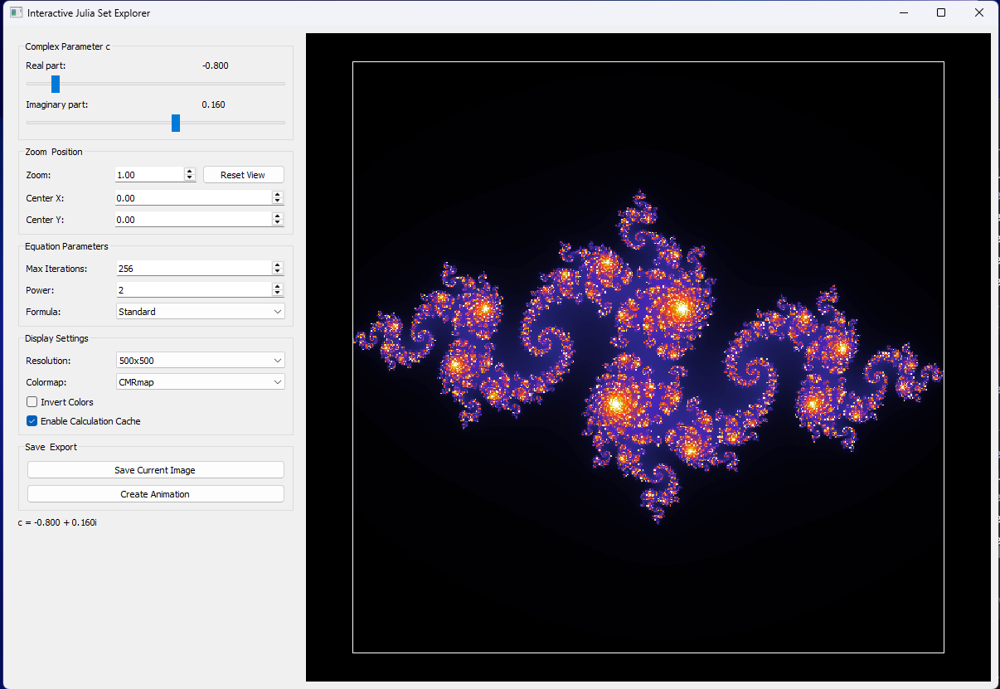

# Julia Set Explorer

Multi-language fractal generator based on the Julia set with Python GUI, command-line interfaces, and Docker support.

## Project Structure

```
Julia_Set/
├── rust/                   # Rust implementation (Docker-ready)
│   ├── src/
│   │   └── main.rs        # Main Rust source
│   ├── Cargo.toml         # Rust dependencies
│   └── Dockerfile         # Docker configuration
├── python/                # Python implementations
│   ├── julia.py          # Command-line interface
│   ├── julia_ui.py       # Interactive GUI
│   ├── requirements.txt  # Python dependencies
│   └── run_julia_ui.bat  # Windows launcher
├── c/                     # C implementation
│   └── julia.c
├── output/                # Generated images
├── docker-compose.yml     # Docker orchestration
├── run_docker.bat        # Windows Docker runner
├── run_docker.sh         # Unix Docker runner
└── README.md
```

## Overview

This project provides tools to generate, explore, and animate beautiful Julia set fractals in multiple programming languages:

- **Rust**: High-performance, Docker-ready implementation with command-line arguments
- **Python**: Interactive GUI and command-line interface with advanced features
- **C**: Lightweight implementation for educational purposes

Features:
- High-performance calculation using optimized algorithms
- Interactive GUI for real-time parameter adjustments (Python)
- Command-line interface for batch processing
- Docker containerization for easy deployment
- Support for creating high-resolution images
- Animation capabilities for creating GIFs (Python)
- Parallel processing for maximum performance


## How It Works

The Julia set is a fractal named after the French mathematician Gaston Julia. For each point (x,y) in the complex plane, the algorithm applies the formula z = z² + c repeatedly, where c is a complex constant. The number of iterations before z "escapes" (exceeds a certain value) determines the color of each pixel.

### Command-Line Interface

The `julia.py` file can be executed from a terminal to generate Julia set images with various parameters:


### GUI Interface

The project now features a full graphical interface (`julia_ui.py`) that allows for interactive exploration:

- Real-time updates when changing parameters
- Zoom and pan functionality
- Adjustable resolution, iterations, and colormaps
- Option to save images or create animations
- Calculation caching for improved performance



## Examples

### Different Resolutions

The same Julia set (c = -0.8 + 0.16j) at different resolutions:

Low resolution (100x100):


High resolution (2000x2000):


### Animations

The generator can create two types of animated GIFs:

1. **Zoom Animation**: Progressively zooms into a part of the fractal


2. **Parameter Animation**: Shows how changes to the complex constant c affect the fractal


## Installation and Usage

### Docker (Recommended)
See the Quick Start section above.

### Rust (Native)
```bash
cd rust
cargo build --release
./target/release/julia_set --help
```

### Python
1. Navigate to the python directory:
```bash
cd python
```

2. Install dependencies:
```bash
pip install -r requirements.txt
```

3. Run the applications:
```bash
# Command-line interface
python julia.py

# Graphical interface
python julia_ui.py

# Or on Windows
run_julia_ui.bat
```

### C
```bash
cd c
gcc -o julia julia.c -lm
./julia
```

## Performance Notes

- The implementation uses Numba for significant performance acceleration
- Calculations are cached to improve responsiveness when exploring
- Multi-core processing is utilized for maximum performance
